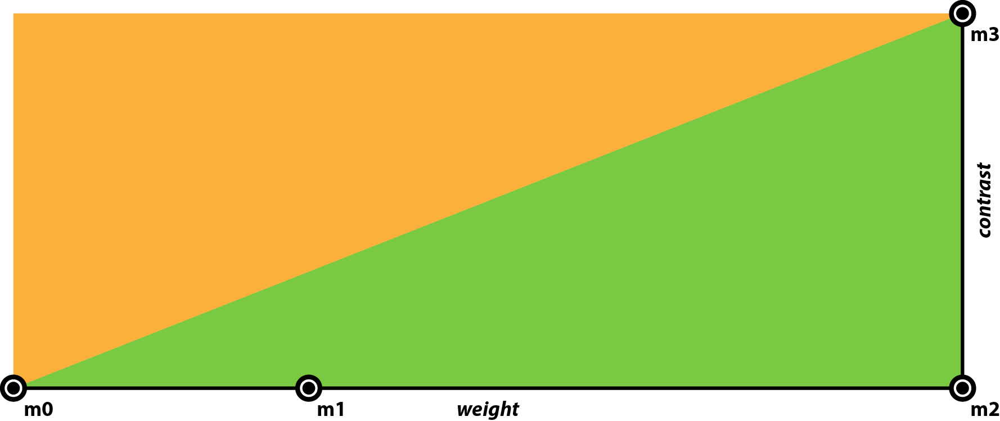
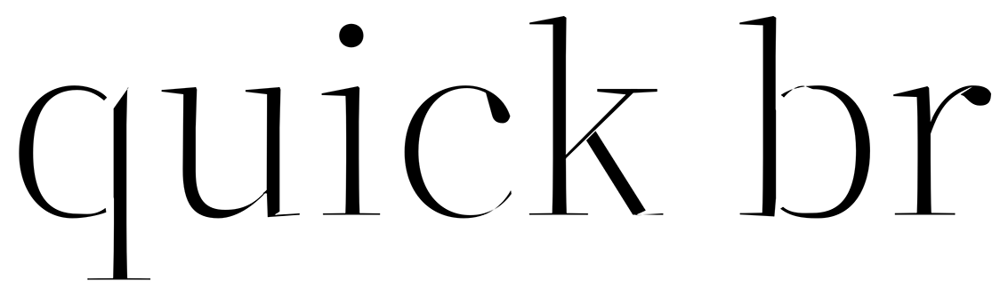
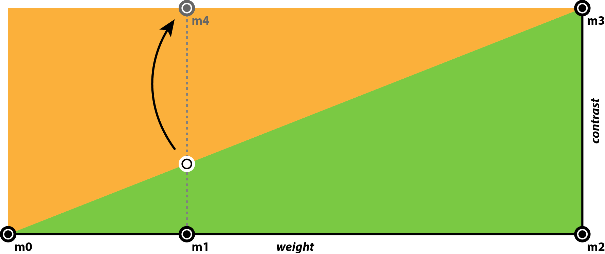
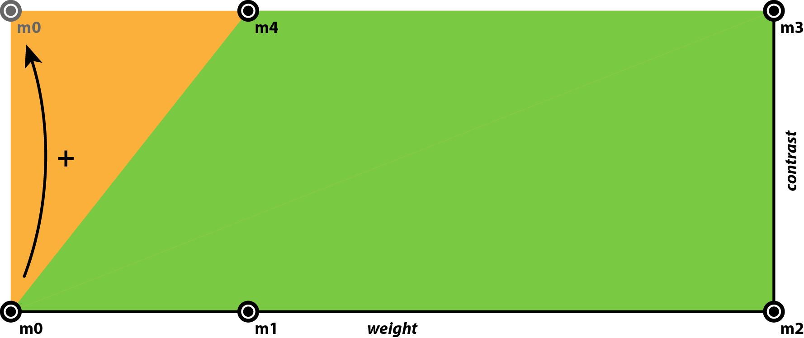
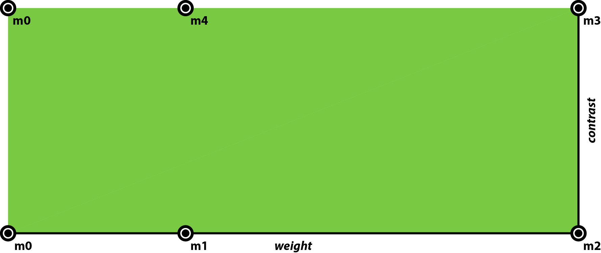
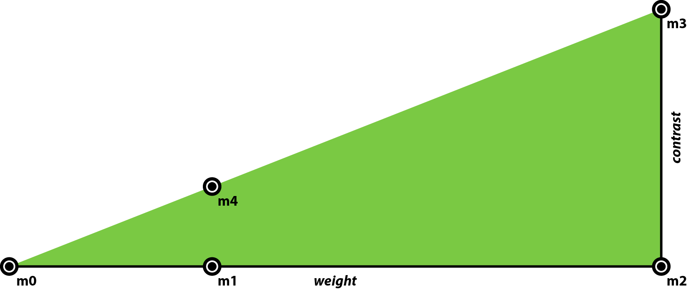

## Design space notes

The original design space of **Adobe Variable Font Prototype** was made up of four masters
arranged along two axes — weight and contrast — as illustrated by Figure 1.

**Figure 1**: Original design space
* **m0** — Extra Light
* **m1** — intermediate master near the Regular instance
* **m2** — Black
* **m3** — Black High Contrast

---
This arrangement of masters produced a fully functional area (marked in green). But at the
same time defined another area (marked in orange) that exposed unusable results, such as
the instance seen in Figure 2.

**Figure 2**: An instance from the orange area of the design space

---
To conceal the orange area of the design space, we used two additional masters that better
delineated the boundaries of the usable area of the design space. The first step required
generating an instance at the intersection defined by the diagonal between **m0** and
**m3**, and the vertical drawn from **m1**. That instance was then introduced into the
design space as **m4** (master_4), as shown in Figure 3.

**Figure 3**: Creation and introduction of **m4** into the design space

---
The second (and last) step consisted in reusing **m0** at the vacant corner of the design
space.

**Figure 4**: Existing master **m0** is used twice

---
And that’s it. With the additional two masters the triangular green area got stretched to
a rectangular shape, filling in the whole design space.

**Figure 5**: Final design space

---

**Figure 6**: Another way to visualize the final design space
